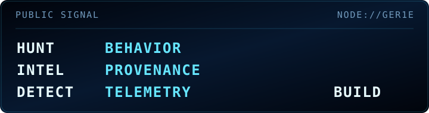
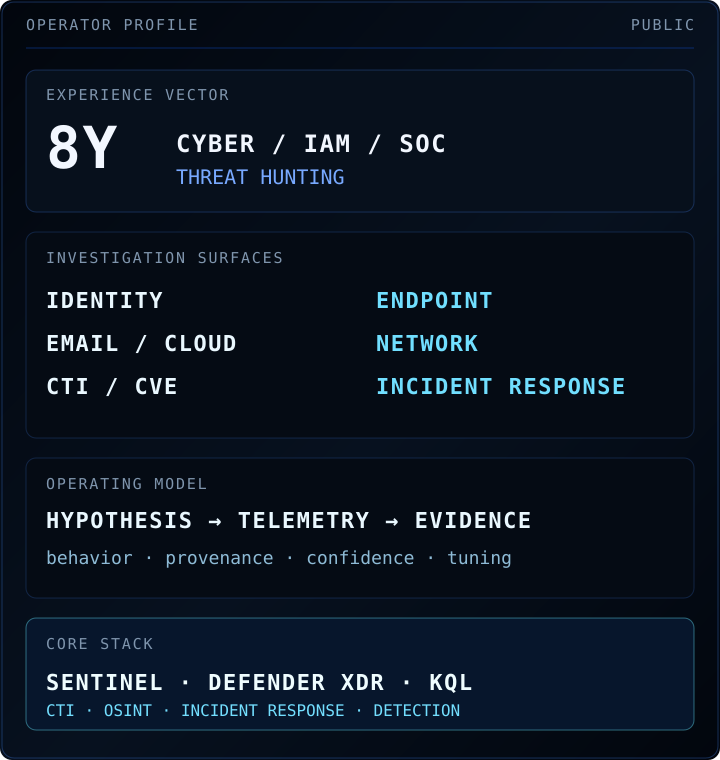

  

  <a href="https://gergoilly.hu/">SITE</a> ·
  <a href="https://www.linkedin.com/in/gergoilly">LI</a> ·
  <a href="https://www.credly.com/users/gergoilly">CREDLY</a> ·
  <a href="https://github.com/ger1e/cti-enrichment-gateway">CTI</a> ·
  <a href="https://github.com/ger1e/threat-hunting-lab">LAB</a>

  

<strong>01 // OPERATOR PROFILE</strong>

  

Cyber Threat Hunter with eight years across enterprise security, IAM, SOC operations and incident response. I turn threat intelligence and behavioral hypotheses into bounded hunts, evidence-backed detections, attack-path reconstruction and remediation decisions across identity, email, endpoint, cloud and network telemetry.

<strong>HUNT</strong> — intelligence-led · behavioral · retrospective  
<strong>OUTPUT</strong> — hunts · detections · scoping · hardening  
<strong>STANDARD</strong> — telemetry first · provenance preserved · inference labeled

<strong>02 // PUBLIC SIGNAL</strong>

**[cti-enrichment-gateway](https://github.com/ger1e/cti-enrichment-gateway)** — read-only CTI enrichment gateway built around fixed provider profiles, evidence-v2 provenance, typed correlation, deterministic reporting, explicit coverage failures and fail-closed egress.

[ARCHITECTURE](https://github.com/ger1e/cti-enrichment-gateway/blob/main/docs/ARCHITECTURE.md) · [THREAT MODEL](https://github.com/ger1e/cti-enrichment-gateway/blob/main/docs/THREAT-MODEL.md) · [PROVIDERS](https://github.com/ger1e/cti-enrichment-gateway/blob/main/docs/PROVIDERS.md) · [SECURITY](https://github.com/ger1e/cti-enrichment-gateway/blob/main/SECURITY.md)

<strong>CTI Gateway coverage — 6 API endpoints / 37 active providers</strong>

**Gateway endpoints:** GET /api/meta · GET /api/health · GET /api/status · POST /api/enrich · POST /api/batch · POST /api/stix

**Network identity, routing & exposure:** IPinfo · RDAP · RIPEstat · Shodan · Censys · Modat Magnify · Cloudflare Radar · Tor Exit List · Spamhaus DROP / ASN-DROP

**Threat reputation & IOC context:** DShield · Feodo Tracker · ThreatMiner · CIRCL MISP OSINT · Botvrij MISP OSINT · GreyNoise · AbuseIPDB · VirusTotal · AlienVault / LevelBlue OTX · ThreatFox · urlscan.io · Webamon · Pulsedive · OpenPhish · URLhaus · TweetFeed.live

**File & malware intelligence:** CIRCL Hashlookup · MalwareBazaar · Malpedia · Hybrid Analysis

**Vulnerability & ATT&CK knowledge:** CISA KEV · FIRST EPSS · CIRCL Vulnerability-Lookup · NVD · OSV · MITRE ATT&CK TAXII

**Ransomware intelligence:** RansomLook · Ransomware.live API-PRO

Supported classes: IP · domain · URL · hash · CVE · ATT&CK ID · ASN · CIDR. Provider execution is controlled by fixed fast, standard and full profiles rather than caller-selected upstreams.

**[threat-hunting-lab](https://github.com/ger1e/threat-hunting-lab)** — sanitized Defender XDR / Sentinel hunting work organized around falsifiable hypotheses, telemetry readiness, ATT&CK context, investigation value, false-positive analysis and tuning guidance.

[HUNTING METHODOLOGY](https://github.com/ger1e/threat-hunting-lab/blob/main/docs/HUNTING-METHODOLOGY.md) · [CTI NORMALIZATION](https://github.com/ger1e/threat-hunting-lab/blob/main/docs/CTI-NORMALIZATION.md) · [CONTRIBUTION CONTRACT](https://github.com/ger1e/threat-hunting-lab/blob/main/CONTRIBUTING.md)

**[personal-site-lp](https://github.com/ger1e/personal-site-lp)** — canonical source for [gergoilly.hu](https://gergoilly.hu/): static-first, restrictive browser policy, custom HTTP error handling, accessibility/reduced-motion support and privacy-conscious telemetry.

**[security intelligence catalog](CATALOG.md)** — curated security tooling and upstream-project intelligence with provenance, lifecycle state, provider mapping and automated health verification.

[CATALOG](CATALOG.md) · [PROVIDERS](PROVIDERS.md) · [LAST VERIFIED](LAST-VERIFIED.md)

<strong>03 // RADAR / INVESTIGATION SURFACE</strong>

  

**IDENTITY + CLOUD** — OAuth, AiTM and device-code abuse · Conditional Access anomalies · mailbox and privileged-account misuse.

**ENDPOINT** — delivery and execution · LOLBins and RMM · persistence · credential access · outbound C2.

**THREAT INTELLIGENCE** — ransomware · APTs · infostealers · exploited CVEs · adversary infrastructure · supply-chain exposure.

**DETECTION ENABLEMENT** — CTI/TTP translation · KQL hunting · telemetry readiness · coverage analysis · false-positive control.

**INCIDENT RESPONSE** — attack-path reconstruction · scoping · evidence correlation · confidence and limitations · remediation.

<strong>04 // TECHNOLOGY & METHODS</strong>

**PRIMARY SECURITY STACK** — Microsoft Sentinel · Defender XDR · Defender for Endpoint · Defender for Office 365 · Entra ID · Conditional Access · KQL.

**INTELLIGENCE** — IBM X-Force · Microsoft Threat Intelligence · Recorded Future · OpenCTI · SOCRadar · LevelBlue OTX · CISA KEV · VirusTotal · urlscan.io · ANY.RUN · Shodan · Censys · passive DNS · TLS/certificate/ASN pivots.

**DETECTION / INVESTIGATION** — PowerShell · regex · YARA/Sigma interpretation · analytics rules · workbooks · Wireshark/PCAP · sandbox analysis.

**FRAMEWORKS** — MITRE ATT&CK · ATT&CK Navigator · MITRE ATLAS · Diamond Model · PEAK · HITS · Cyber Kill Chain · Pyramid of Pain · NIST CSF.

**ADJACENT** — Splunk/SPL · IBM QRadar/AQL · CrowdStrike Falcon/FQL · Elastic · Tenable · Qualys · AWS · Linux · Windows · macOS.

<strong>05 // CERTIFICATIONS & RECOGNITION</strong>

  
  
  

**Selected credentials:** INE eCTHP · TryHackMe SAL2 · INE ICCA · CompTIA CySA+ · MCRTA · CAP · CNSP · IBM Cybersecurity Specialist · Google Cybersecurity Professional Certificate V2.

**Recognition:** TryHackMe SAL2 Founding Operator · IBM Mentor · Credly Top Badge Earner · TryHackMe Top 1%.

<strong>06 // CAREER VECTOR</strong>

  

<strong>07 // INTELLIGENCE FABRIC</strong>

[REPO CATALOG](catalog/repos.yaml) · [PROVIDER MAP](catalog/providers.yaml) · [SECURITY REPOS](SECURITY-REPOS.md) · [SOC MANUAL REPOS](SOC-MANUAL-REPOS.md) · [API TOOL REPOS](API-TOOLS-REPOS.md)

<strong>HYPOTHESIS</strong> → TELEMETRY → QUERY → EVIDENCE → TUNING  
<strong>SOURCE</strong> → PROVENANCE → CONTEXT → CORRELATION → CONFIDENCE

  

