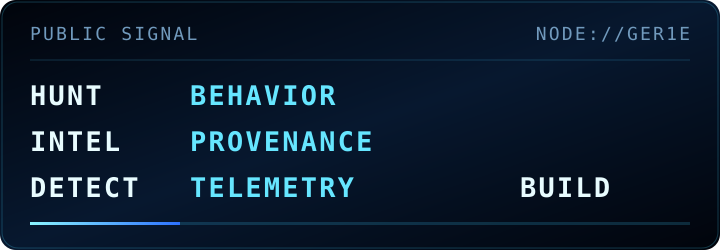
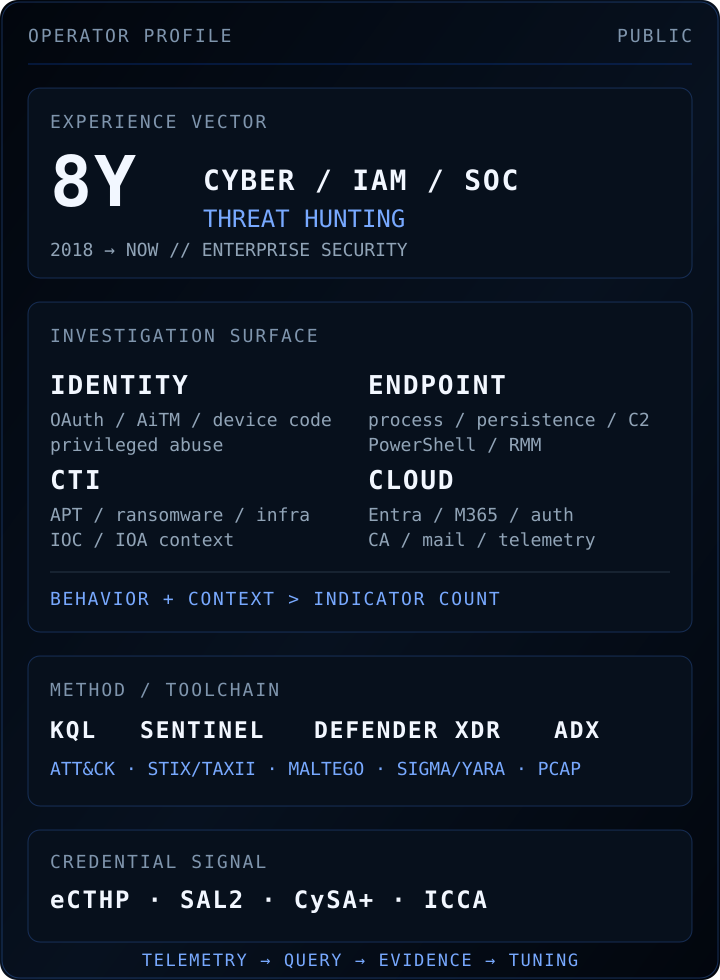

<p align="center">
  
</p>

<p align="center">
  <a href="https://gergoilly.hu/">SITE</a> ·
  <a href="https://www.linkedin.com/in/gergoilly">LI</a> ·
  <a href="https://www.credly.com/users/gergoilly">CREDLY</a> ·
  <a href="https://github.com/ger1e/cti-enrichment-gateway">CTI</a> ·
  <a href="https://github.com/ger1e/threat-hunting-lab">LAB</a>
</p>

<p align="center">
  
</p>

#### `01` OPERATOR PROFILE

<p align="center">
  <picture>
    <source media="(min-width: 601px)" srcset="assets/operator-console.svg">
    
  </picture>
</p>

Cyber Threat Hunter with eight years across managed security services, incident response, enterprise IAM and secure cloud platforms. I run intelligence-led, behavioral and retrospective hunts; reconstruct identity, email, endpoint and cloud attack paths; translate external intelligence into hunt and detection candidates; and report evidence, confidence, limitations and remediation.

`HUNT → INTELLIGENCE-LED · BEHAVIORAL · RETROSPECTIVE`  
`OUTPUT → HUNTS · DETECTIONS · SCOPING · HARDENING`  
`RULE → TELEMETRY FIRST · PROVENANCE PRESERVED · INFERENCE LABELED`

#### `02` PUBLIC SIGNAL

**[`cti-enrichment-gateway`](https://github.com/ger1e/cti-enrichment-gateway)** — bounded read-only CTI enrichment gateway with fixed provider workflows, evidence-v2 provenance, typed correlation, STIX 2.1 export, Maltego transforms, deterministic offline reporting, explicit coverage failures and a fail-closed egress/security model.

[`ARCHITECTURE`](https://github.com/ger1e/cti-enrichment-gateway/blob/main/docs/ARCHITECTURE.md) · [`THREAT MODEL`](https://github.com/ger1e/cti-enrichment-gateway/blob/main/docs/THREAT-MODEL.md) · [`PROVIDERS`](https://github.com/ger1e/cti-enrichment-gateway/blob/main/docs/PROVIDERS.md) · [`SECURITY`](https://github.com/ger1e/cti-enrichment-gateway/blob/main/SECURITY.md)

<details>
<summary><strong>CTI Gateway coverage — 6 API endpoints / 37 active providers</strong></summary>

**Gateway endpoints:** `GET /api/meta` · `GET /api/health` · `GET /api/status` · `POST /api/enrich` · `POST /api/batch` · `POST /api/stix`

**Network identity, routing & exposure:** IPinfo · RDAP · RIPEstat · Shodan · Censys · Modat Magnify · Cloudflare Radar · Tor Exit List · Spamhaus DROP / ASN-DROP

**Threat reputation & IOC context:** DShield · Feodo Tracker · ThreatMiner · CIRCL MISP OSINT · Botvrij MISP OSINT · GreyNoise · AbuseIPDB · VirusTotal · AlienVault / LevelBlue OTX · ThreatFox · urlscan.io · Webamon · Pulsedive · OpenPhish · URLhaus · TweetFeed.live

**File & malware intelligence:** CIRCL Hashlookup · MalwareBazaar · Malpedia · Hybrid Analysis

**Vulnerability & ATT&CK knowledge:** CISA KEV · FIRST EPSS · CIRCL Vulnerability-Lookup · NVD · OSV · MITRE ATT&CK TAXII

**Ransomware intelligence:** RansomLook · Ransomware.live API-PRO

Supported classes: IP · domain · URL · hash · CVE · ATT&CK ID · ASN · CIDR. Provider execution is controlled by fixed `fast`, `standard`, and `full` profiles rather than caller-selected upstreams.

</details>

**[`threat-hunting-lab`](https://github.com/ger1e/threat-hunting-lab)** — sanitized Microsoft Defender XDR / Sentinel hunting work organized around falsifiable hypotheses, telemetry readiness, ATT&CK context, investigation value, false-positive analysis, tuning guidance and CTI normalization.

[`HUNTING METHODOLOGY`](https://github.com/ger1e/threat-hunting-lab/blob/main/docs/HUNTING-METHODOLOGY.md) · [`CTI NORMALIZATION`](https://github.com/ger1e/threat-hunting-lab/blob/main/docs/CTI-NORMALIZATION.md) · [`CONTRIBUTION CONTRACT`](https://github.com/ger1e/threat-hunting-lab/blob/main/CONTRIBUTING.md)

**[`personal-site-lp`](https://github.com/ger1e/personal-site-lp)** — canonical source for [`gergoilly.hu`](https://gergoilly.hu/): a static-first personal security site with a deliberately small runtime surface, restrictive browser policy, custom HTTP error handling, accessibility/reduced-motion support and privacy-conscious telemetry.

**[`security intelligence catalog`](CATALOG.md)** — curated security tooling and upstream-project intelligence with provenance, lifecycle state, provider mapping and automated health verification.

[`CATALOG`](CATALOG.md) · [`PROVIDERS`](PROVIDERS.md) · [`LAST VERIFIED`](LAST-VERIFIED.md)

#### `03` RADAR / INVESTIGATION SURFACE

<p align="center">
  <picture>
    <source media="(min-width: 601px)" srcset="assets/threat-radar.svg">
    
  </picture>
</p>

| Track | Investigation focus |
| --- | --- |
| **Identity & cloud abuse** | OAuth / AiTM / device-code abuse · Conditional Access anomalies · mailbox / privileged-account misuse |
| **Endpoint intrusion** | delivery · browser activity · script execution · LOLBins · RMM · persistence · credential access · outbound C2 |
| **Threat intelligence** | ransomware · APT · infostealers · exploited CVEs · adversary infrastructure · supply-chain exposure |
| **Detection enablement** | CTI / TTP translation · KQL hunting · telemetry readiness · coverage analysis · false-positive control |
| **Incident response** | attack-path reconstruction · scoping · evidence correlation · confidence / limitations · remediation |

#### `04` TECHNOLOGY & METHODS

| Surface | Working set |
| --- | --- |
| **Microsoft security** | Sentinel · Defender XDR Advanced Hunting · Defender for Endpoint · Defender for Office 365 · Entra ID · Conditional Access · Azure Data Explorer · Microsoft 365 security telemetry · Safe Links |
| **CTI / OSINT** | IBM X-Force · Microsoft Threat Intelligence · Recorded Future · OpenCTI · SOCRadar · LevelBlue OTX · Maltego · STIX/TAXII · CISA KEV · VirusTotal · urlscan.io · ANY.RUN · Shodan · Censys · passive DNS · TLS/certificate pivots · ASN/BGP enrichment |
| **Detection / investigation** | KQL · PowerShell · regex · YARA/Sigma interpretation · analytics rules · watchlists · workbooks · Wireshark/PCAP · sandbox analysis |
| **Frameworks** | MITRE ATT&CK · ATT&CK Navigator · MITRE ATLAS · Diamond Model · PEAK · HITS · Cyber Kill Chain · Pyramid of Pain · NIST CSF |
| **Prior / adjacent** | Splunk/SPL · IBM QRadar/AQL · CrowdStrike Falcon/FQL · Elastic Stack · Kibana · Lucene · Elasticsearch Query DSL · Tenable · Qualys · AWS · Linux · Windows · macOS |

#### `05` CERTIFICATIONS & RECOGNITION

<p align="center">
  <a href="https://www.credly.com/org/comptia/badge/comptia-cysa-ce-certification"></a>
  
  <a href="https://www.credly.com/org/tryhackme/badge/security-analyst-level-2-sal2"></a>
</p>

**Selected:** INE eCTHP · TryHackMe SAL2 · INE ICCA · CompTIA CySA+ · MCRTA · CAP · CNSP · IBM Cybersecurity Specialist · Google Cybersecurity Professional Certificate V2

**Recognition:** TryHackMe SAL2 Founding Operator · IBM Mentor · Credly Top Badge Earner · TryHackMe Top 1%

#### `06` CAREER VECTOR

```text
2025 → NOW   CYBERSECURITY CONSULTANT / CYBER THREAT HUNTER   IBM CONSULTING
2024 → 2025  CYBERSECURITY SPECIALIST / SOC ANALYST L2        IBM CONSULTING
2021 → 2023  TECHNICAL SUCCESS SPECIALIST                     PIX SYSTEM / X2X MEDIA GROUP
2018 → 2021  INFORMATION SECURITY ANALYST / CISO GIAM         CITIBANK EUROPE
```

#### `07` INTELLIGENCE FABRIC

[`repos.yaml`](catalog/repos.yaml) · [`providers.yaml`](catalog/providers.yaml) · [`SECURITY-REPOS.md`](SECURITY-REPOS.md) · [`SOC-MANUAL-REPOS.md`](SOC-MANUAL-REPOS.md) · [`API-TOOLS-REPOS.md`](API-TOOLS-REPOS.md)

```text
HYPOTHESIS → TELEMETRY → QUERY → EVIDENCE → TUNING
SOURCE     → PROVENANCE → CONTEXT → CORRELATION → CONFIDENCE

DETECTION WITHOUT TELEMETRY     = A WISH
INTELLIGENCE WITHOUT PROVENANCE = A RUMOR
AUTOMATION WITHOUT CONTEXT      = FASTER WRONGNESS
```
