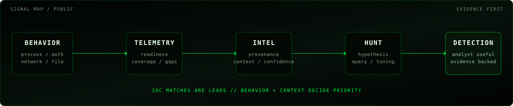

<p align="center">
  
</p>

<p align="center"><code>ム乇 尺1乇 // SIGNAL NODE</code></p>
<p align="center"><strong>THREAT HUNTING × CTI × DETECTION ENGINEERING</strong></p>

<p align="center">
  
</p>

```text
┌──[ GER1E // ONLINE ]
│
├─ HUNT     adversary behavior · endpoint · identity · network
├─ INTEL    campaigns · infrastructure · malware · vulnerabilities
├─ DETECT   KQL · analytics · ATT&CK · detection engineering
└─ BUILD    Python · automation · enrichment · analyst tooling
```

I hunt attacker behavior, correlate threat intelligence, and turn evidence into detections and investigation workflows. The useful part is the collision point between telemetry, adversary tradecraft, automation, and analyst judgment.

## Public signal

### [`threat-hunting-lab`](https://github.com/ger1e/threat-hunting-lab)
Sanitized Microsoft Defender XDR / Sentinel hunting examples with explicit hypotheses, telemetry requirements, ATT&CK context, false-positive analysis, tuning guidance, and CTI normalization.

### [`personal-site-lp`](https://github.com/ger1e/personal-site-lp)
Personal landing page: custom front-end, responsive behavior, metadata, accessibility work, and production hardening.

### [`security intelligence catalog`](CATALOG.md)
Curated security tooling and upstream-project catalog with provenance, lifecycle state, provider mapping, and automated health verification.

<p align="center">
  
</p>

## Signal stack

| Function | Working set |
| --- | --- |
| Hunt / Detect | Microsoft Defender XDR · Microsoft Sentinel · KQL · MITRE ATT&CK |
| Endpoint / Identity | process · network · file · authentication telemetry |
| CTI / OSINT | API enrichment · infrastructure correlation · IOC / TTP context |
| Analysis | malware triage · reverse engineering · behavioral extraction · lineage |
| Build | Python · PowerShell · Bash · GitHub Actions · REST APIs |

## Operating model

```text
HYPOTHESIS → TELEMETRY → QUERY → EVIDENCE → TUNING
SOURCE     → PROVENANCE → CONTEXT → CORRELATION → CONFIDENCE
```

- Behavior over indicator worship.
- Evidence separated from inference.
- Telemetry assumptions stated before conclusions.
- Provenance preserved through enrichment.
- Detection output optimized for analyst use, not query-golf aesthetics.

## Credentials

<p align="center">
  <a href="https://www.credly.com/org/comptia/badge/comptia-cysa-ce-certification"></a>
  &nbsp;&nbsp;
  <a href="https://www.credly.com/org/tryhackme/badge/security-analyst-level-2-sal2"></a>
</p>

## Intelligence catalog

[`CATALOG.md`](CATALOG.md) · [`repos.yaml`](catalog/repos.yaml) · [`PROVIDERS.md`](PROVIDERS.md) · [`providers.yaml`](catalog/providers.yaml) · [`LAST-VERIFIED.md`](LAST-VERIFIED.md) · [`SECURITY-REPOS.md`](SECURITY-REPOS.md) · [`SOC-MANUAL-REPOS.md`](SOC-MANUAL-REPOS.md) · [`API-TOOLS-REPOS.md`](API-TOOLS-REPOS.md)

## Rules of engagement

```text
DETECTION WITHOUT TELEMETRY     = A WISH
INTELLIGENCE WITHOUT PROVENANCE = A RUMOR
AUTOMATION WITHOUT CONTEXT      = FASTER WRONGNESS
```

## Exit nodes

[`THREAT HUNTING LAB`](https://github.com/ger1e/threat-hunting-lab) · [`SECURITY CATALOG`](CATALOG.md) · [`PROVIDER REGISTRY`](PROVIDERS.md)
