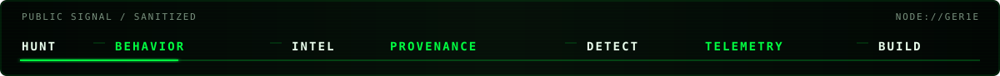
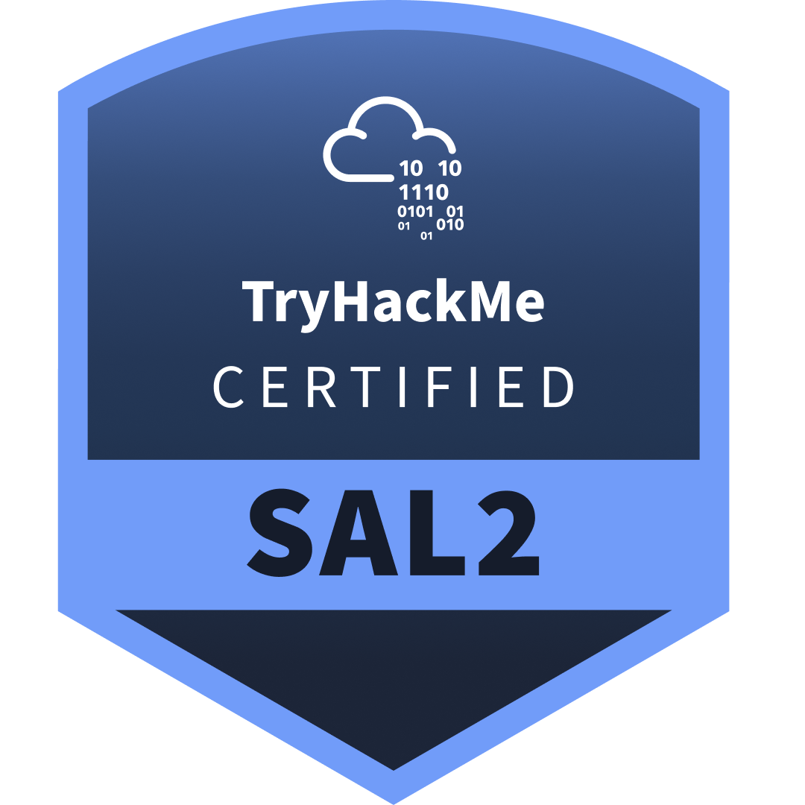

<p align="center">
  
</p>

<p align="center"><code>ム乇 尺1乇 // SIGNAL NODE</code></p>
<p align="center"><strong>THREAT HUNTING × CTI × DETECTION ENGINEERING</strong></p>

<p align="center">
  
</p>

I hunt attacker behavior, correlate threat intelligence, and turn evidence into detections and investigation workflows. Telemetry first. Provenance preserved. Inference labeled.

## Primary signal

### [`threat-hunting-lab`](https://github.com/ger1e/threat-hunting-lab)
Sanitized Microsoft Defender XDR / Sentinel hunting work built around explicit hypotheses, telemetry requirements, ATT&CK context, false-positive analysis, tuning guidance, and CTI normalization.

[`device-code follow-on`](https://github.com/ger1e/threat-hunting-lab/blob/main/hunts/device-code-follow-on.kql) · [`rare outbound beaconing`](https://github.com/ger1e/threat-hunting-lab/blob/main/hunts/rare-outbound-beaconing.kql) · [`encoded PowerShell`](https://github.com/ger1e/threat-hunting-lab/blob/main/hunts/suspicious-powershell-encoded-command.kql)

### [`security intelligence catalog`](CATALOG.md)
Curated security tooling and upstream-project intelligence with provenance, lifecycle state, provider mapping, and automated health verification.

[`CATALOG`](CATALOG.md) · [`PROVIDERS`](PROVIDERS.md) · [`LAST VERIFIED`](LAST-VERIFIED.md)

<sub>Other build surface: [`personal-site-lp`](https://github.com/ger1e/personal-site-lp)</sub>

## Radar / signal fusion

<p align="center">
  
</p>

## Working set

| Function | Stack |
| --- | --- |
| Hunt / Detect | Microsoft Defender XDR · Microsoft Sentinel · KQL · MITRE ATT&CK |
| Endpoint / Identity | process · network · file · authentication telemetry |
| CTI / OSINT | API enrichment · infrastructure correlation · IOC / TTP context |
| Analysis | malware triage · reverse engineering · behavioral extraction · lineage |
| Build | Python · PowerShell · Bash · GitHub Actions · REST APIs |

## Operator doctrine

```text
HYPOTHESIS → TELEMETRY → QUERY → EVIDENCE → TUNING
SOURCE     → PROVENANCE → CONTEXT → CORRELATION → CONFIDENCE

BEHAVIOR > INDICATOR
EVIDENCE > ASSUMPTION
SIGNAL   > NOISE
```

Queries should state the telemetry assumptions that make them meaningful. IOC matches are leads, not conclusions. Detection output should be useful to the analyst who has to investigate it.

## Credentials

<p align="center">
  <a href="https://www.credly.com/org/comptia/badge/comptia-cysa-ce-certification"></a>
  &nbsp;&nbsp;
  
  &nbsp;&nbsp;
  <a href="https://www.credly.com/org/tryhackme/badge/security-analyst-level-2-sal2"></a>
</p>
<p align="center"><sub>CompTIA CySA+ · INE eCTHP · TryHackMe SAL2</sub></p>

## Intelligence fabric

[`repos.yaml`](catalog/repos.yaml) · [`providers.yaml`](catalog/providers.yaml) · [`SECURITY-REPOS.md`](SECURITY-REPOS.md) · [`SOC-MANUAL-REPOS.md`](SOC-MANUAL-REPOS.md) · [`API-TOOLS-REPOS.md`](API-TOOLS-REPOS.md)

```text
DETECTION WITHOUT TELEMETRY     = A WISH
INTELLIGENCE WITHOUT PROVENANCE = A RUMOR
AUTOMATION WITHOUT CONTEXT      = FASTER WRONGNESS
```
