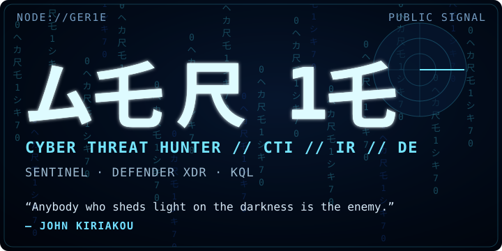
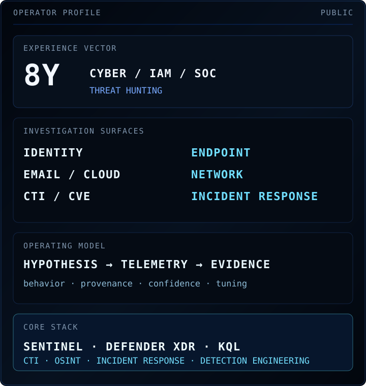
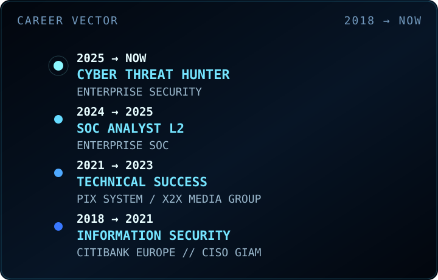

  

  <a href="https://gergoilly.hu/">SITE</a> ·
  <a href="https://www.linkedin.com/in/gergoilly">LI</a> ·
  <a href="https://www.credly.com/users/gergoilly">CREDLY</a> ·
  <a href="https://github.com/ger1e/para11ax">CTI</a> ·
  <a href="https://github.com/ger1e/threat-hunting-lab">LAB</a>

<strong>01 // OPERATOR PROFILE</strong>

Cyber Threat Hunter with eight years across enterprise security, IAM, SOC operations and incident response. I turn threat intelligence and behavioral hypotheses into falsifiable hunts, evidence-backed detections, attack-path reconstruction and remediation guidance across identity, email, endpoint, cloud and network telemetry.

<strong>HUNT</strong> — intelligence-led · behavioral · retrospective 
<strong>OUTPUT</strong> — hunts · detections · scoping · remediation 
<strong>STANDARD</strong> — telemetry first · provenance preserved · inference explicit

<b>Operator profile</b>

<strong>02 // PUBLIC SIGNAL</strong>

**[PARA11AX](https://github.com/ger1e/para11ax)** — read-only CTI evidence gateway with fixed provider profiles, Evidence v2 provenance, typed correlation, deterministic reporting, explicit coverage failures, and fail-closed egress.

[LIVE](https://para11ax.vercel.app/) · [ARCHITECTURE](https://github.com/ger1e/para11ax/blob/main/docs/ARCHITECTURE.md) · [THREAT MODEL](https://github.com/ger1e/para11ax/blob/main/docs/THREAT-MODEL.md) · [PROVIDERS](https://github.com/ger1e/para11ax/blob/main/docs/PROVIDERS.md) · [SECURITY](https://github.com/ger1e/para11ax/blob/main/SECURITY.md)

**[threat-hunting-lab](https://github.com/ger1e/threat-hunting-lab)** — sanitized Defender XDR / Sentinel hunting content built around falsifiable hypotheses, telemetry readiness, ATT&CK context, investigation value, false-positive analysis and tuning guidance.

[HUNTING METHODOLOGY](https://github.com/ger1e/threat-hunting-lab/blob/main/docs/HUNTING-METHODOLOGY.md) · [CTI NORMALIZATION](https://github.com/ger1e/threat-hunting-lab/blob/main/docs/CTI-NORMALIZATION.md) · [CONTRIBUTION CONTRACT](https://github.com/ger1e/threat-hunting-lab/blob/main/CONTRIBUTING.md)

**[personal-site-lp](https://github.com/ger1e/personal-site-lp)** — canonical source for [gergoilly.hu](https://gergoilly.hu/): a static-first personal security site with restrictive browser policy, custom HTTP error handling, reduced-motion support and privacy-conscious telemetry.

<strong>PARA11AX coverage — 6 API endpoints / 38 configured sources</strong>

**Gateway endpoints:** GET /api/para11ax/meta · GET /api/para11ax/health · GET /api/para11ax/status · POST /api/para11ax/enrich · POST /api/para11ax/batch · POST /api/para11ax/stix

**Network identity, routing & exposure:** IPinfo · RDAP · RIPEstat · Shodan · Censys · Modat Magnify · Cloudflare Radar · Tor Exit List · Spamhaus DROP / ASN-DROP

**Threat reputation & IOC context:** DShield · Feodo Tracker · ThreatMiner · CIRCL MISP OSINT · Botvrij MISP OSINT · GreyNoise · AbuseIPDB · VirusTotal · AlienVault / LevelBlue OTX · ThreatFox · urlscan.io · Webamon · Pulsedive · OpenPhish · URLhaus · TweetFeed.live

**File & malware intelligence:** CIRCL Hashlookup · MalwareBazaar · Malpedia · Hybrid Analysis

**Vulnerability & ATT&CK knowledge:** CISA KEV · FIRST EPSS · CIRCL Vulnerability-Lookup · NVD · OSV · MITRE ATT&CK TAXII

**Ransomware intelligence:** RansomLook · Ransomware.live API-PRO

Supported classes: IP · domain · URL · hash · CVE · ATT&CK ID · ASN · CIDR. Fixed fast, standard and full profiles control provider execution; callers cannot select arbitrary upstreams.

**[security intelligence catalog](CATALOG.md)** — curated index of security tooling and upstream projects with provenance, lifecycle state, provider mapping and automated health checks.

[CATALOG](CATALOG.md) · [PROVIDERS](PROVIDERS.md) · [LAST VERIFIED](LAST-VERIFIED.md)

<strong>03 // RADAR / INVESTIGATION SURFACE</strong>

**IDENTITY + CLOUD** — OAuth, AiTM and device-code abuse · Conditional Access anomalies · mailbox and privileged-account misuse.

**ENDPOINT** — delivery and execution · LOLBins and RMM · persistence · credential access · outbound C2.

**INTELLIGENCE** — ransomware · APTs · infostealers · exploited CVEs · adversary infrastructure · supply-chain exposure.

**DETECTION ENGINEERING** — CTI/TTP translation · KQL hunting · telemetry readiness · coverage analysis · false-positive tuning.

**INCIDENT RESPONSE** — attack-path reconstruction · scoping · evidence correlation · confidence bounds · remediation.

<b>Investigation surface</b>

<strong>04 // TECHNOLOGY & METHODS</strong>

<strong>PRIMARY STACK</strong> — Microsoft Sentinel · Defender XDR · Defender for Endpoint · Defender for Office 365 · Entra ID · Conditional Access · KQL.

<strong>INTELLIGENCE</strong> — IBM X-Force · Microsoft Threat Intelligence · Recorded Future · OpenCTI · CISA KEV · VirusTotal · urlscan.io · ANY.RUN · Shodan · Censys · passive DNS · certificate/ASN pivots.

<strong>DETECTION ENGINEERING</strong> — KQL · analytics rules · workbooks · YARA/Sigma · PowerShell · regex.

<strong>SECURITY & DEVELOPMENT TOOLING</strong> — Snyk · Codex Security · Git · GitHub Actions.

<strong>INVESTIGATION</strong> — Wireshark/PCAP · sandbox analysis · endpoint, identity, email and cloud correlation.

<strong>FRAMEWORKS</strong> — MITRE ATT&CK · ATT&CK Navigator · MITRE ATLAS · Diamond Model · PEAK · HITS · Cyber Kill Chain · Pyramid of Pain · NIST CSF.

<strong>ADJACENT EXPERIENCE</strong> — Splunk/SPL · IBM QRadar/AQL · CrowdStrike Falcon/FQL · Elastic · Tenable · Qualys · AWS · Linux · Windows · macOS.

<strong>05 // CERTIFICATIONS & RECOGNITION</strong>

  
  
  

<strong>CORE CREDENTIALS</strong> — INE eCTHP · CompTIA CySA+ · TryHackMe SAL2 · INE ICCA. 
<strong>ADDITIONAL CREDENTIALS</strong> — MCRTA · CAP · CNSP · IBM Cybersecurity Specialist · Google Cybersecurity Professional Certificate V2. 
<strong>RECOGNITION</strong> — TryHackMe SAL2 Founding Operator · TryHackMe Top 1% · IBM Mentor · Credly Top Badge Earner.

<strong>06 // CAREER VECTOR</strong>

<b>Career timeline</b>

<strong>07 // INTELLIGENCE FABRIC</strong>

[REPO CATALOG](catalog/repos.yaml) · [PROVIDER MAP](catalog/providers.yaml) · [SECURITY ATLAS](SECURITY-REPOS.md) · [API TOOL INDEX](API-TOOLS-REPOS.md)

<strong>HYPOTHESIS</strong> → TELEMETRY → QUERY → EVIDENCE → TUNING 
<strong>SOURCE</strong> → PROVENANCE → CONTEXT → CORRELATION → CONFIDENCE

